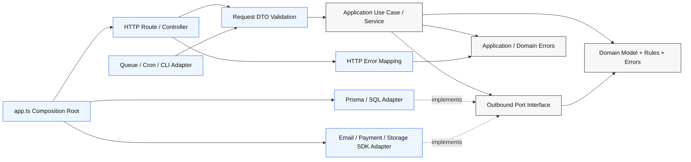

# Hexagonal Node

## Overview

Use this skill to structure Node.js backends around feature-owned hexagons: domain model at the center, application use cases around it, HTTP/persistence/external-service adapters at the edges, and a composition root that wires everything together.

The goal is dependency control. Business rules should not know whether the request came from Hono, Express, Fastify, NestJS, a queue, a cron job, or a CLI. Persistence details should not leak into use cases.

## Core Schema



Dependency direction:

```txt
infrastructure/http       -> application -> domain
infrastructure/persistence -> application/domain
infrastructure/external   -> application/domain
app composition root      -> infrastructure + application
domain                   -> no framework, no database, no process.env
application              -> no HTTP framework, no ORM client, no SDKs
```

## Canonical Feature Structure

```txt
src/features/<feature>/
  domain/
    <feature>.ts                  # entities, value objects, domain types
    <feature>-errors.ts           # domain errors
    <feature>-repository.ts       # outbound persistence port
    <feature>-policies.ts         # pure authorization/business policies

  application/
    <feature>-service.ts          # use cases; orchestrates ports and domain
    <feature>-commands.ts         # input command types if not in domain
    <feature>-unit-of-work.ts     # transaction port, only if needed

  infrastructure/
    http/
      <feature>-routes.ts         # Hono/Express/Fastify/Nest adapter
      <feature>-request.ts        # unknown request -> command parsing
      <feature>-response.ts       # domain -> response DTO if needed
    persistence/
      prisma-<feature>-repository.ts
      in-memory-<feature>-repository.ts
    external/
      <provider>-<feature>-adapter.ts

tests/parcours/
  <feature>-members.test.ts       # only when explicitly requested
  <feature>-budget.test.ts        # broad user/API workflow coverage
```

Keep feature code together. Avoid global `controllers/`, `services/`, `repositories/`, and `models/` buckets unless the project already enforces that convention.

## Layer Responsibilities

| Layer | Owns | Must Not Import |
| --- | --- | --- |
| `domain` | Entities, value objects, domain errors, repository port types, pure policies | Hono/Express/Nest, Prisma/ORM, SDKs, `process.env`, HTTP DTOs |
| `application` | Use cases, transactions through ports, authorization orchestration, command normalization | HTTP request/response types, ORM clients, vendor SDKs, framework decorators |
| `infrastructure/http` | Routing, request parsing, response mapping, status codes, error-to-HTTP mapping | Persistence implementation details except through composition |
| `infrastructure/persistence` | ORM/SQL/NoSQL mappings, transactions, repository implementations | HTTP route/controller types |
| `infrastructure/external` | Email/payment/storage/auth/queue provider adapters | HTTP route/controller types |
| `app.ts` / composition | Dependency wiring, config injection, adapter selection | Business decisions |
| `tests/parcours` | Explicitly requested journey tests through public feature/API/workflow boundaries | Private helpers, isolated adapters, hidden cross-feature fixtures |

## Ports And Adapters

Create a port when application logic needs an external or volatile capability: database, email, payment provider, object storage, queue, clock, UUID generation, transaction boundary, auth identity provider, feature flag provider.

Do not create ports for every pure helper. Pure business rules belong in functions/classes in `domain`.

Treat HTTP routes, queue consumers, cron jobs, CLIs, and explicitly requested parcours tests as driving adapters: they call the application. Treat databases, SDKs, queues, mailers, storage, clocks, and ID generators as driven adapters: the application calls them through ports.

**Outbound port:**

```ts
// domain/family-repository.ts
import type { FamilySnapshot, RecurringLine } from "./family.js";

export interface FamilyRepository {
  findByUserId(userId: string): Promise<FamilySnapshot | null>;
  saveFamily(family: FamilySnapshot): Promise<FamilySnapshot>;
  createRecurringLine(
    familyId: string,
    line: RecurringLine,
  ): Promise<FamilySnapshot>;
}
```

**Application service:**

```ts
// application/family-service.ts
import type { FamilyRepository } from "../domain/family-repository.js";
import { InvalidFamilyInputError } from "../domain/family.js";

export class FamilyService {
  constructor(private readonly repository: FamilyRepository) {}

  async addMember(input: CreateFamilyMemberInput): Promise<FamilySnapshot> {
    const name = requireText(input.name, "Member name is required.");
    const family = await this.repository.findByUserId(input.userId);

    if (!family) {
      throw new InvalidFamilyInputError("Family was not found.");
    }

    return this.repository.saveFamily({
      ...family,
      members: [...family.members, { id: input.memberId, name }],
    });
  }
}
```

**HTTP adapter:**

```ts
// infrastructure/http/family-routes.ts
import { Hono } from "hono";
import type { FamilyService } from "../../application/family-service.js";

export function createFamilyRouter(service: FamilyService): Hono {
  const router = new Hono();

  router.post("/members", async (context) => {
    const input = parseCreateMemberInput(await context.req.json());
    const family = await service.addMember(input);
    return context.json(family, 201);
  });

  return router;
}
```

**Composition root:**

```ts
// app.ts
const repository = new PrismaFamilyRepository(prisma);
const service = new FamilyService(repository);
app.route("/api/family", createFamilyRouter(service));
```

## Request And DTO Boundaries

Validate untrusted input at the adapter boundary before calling application code.

Rules:

- `unknown` request body enters `infrastructure/http`.
- Parser returns an application command or domain input type.
- Application revalidates business invariants that cannot be trusted from adapters.
- HTTP adapter maps domain/application errors to status codes.
- Never expose raw internal errors or stack traces in production responses.
- Authentication extraction belongs in adapters/middleware; authorization decisions belong in application/domain policies.
- Tenant/user IDs used for protected data access must come from trusted server-side context, not from client-provided request bodies.

```ts
function readJsonObject(value: unknown): Record<string, unknown> {
  if (typeof value === "object" && value !== null && !Array.isArray(value)) {
    return value as Record<string, unknown>;
  }

  throw new InvalidInputError("Request body must be a JSON object.");
}
```

## Transactions And Consistency

Use a transaction port only when a use case needs multiple writes to commit or roll back together.

```txt
application/
  transfer-money.ts        # calls unitOfWork.run(...)
  unit-of-work.ts          # port
infrastructure/persistence/
  prisma-unit-of-work.ts   # adapter
```

If a single repository method can safely encapsulate the transaction, keep the transaction inside the persistence adapter. Do not make HTTP controllers manage transactions.

## Error Mapping

Domain/application errors should be semantic and framework-free: `InvalidFamilyInputError`, `RecurringLineNotFoundError`, `UnauthorizedFamilyAccessError`.

HTTP adapters map those errors to transport concerns:

```txt
Invalid input      -> 400
Unauthenticated    -> 401
Unauthorized       -> 403
Not found          -> 404
Conflict/version   -> 409
Unhandled internal -> 500 with generic response
```

Log server-side details where the project has observability, but do not return stack traces, SQL errors, secrets, or provider payloads to clients.

## Parcours Test Layout

```txt
tests/parcours/
  family-members.test.ts
  family-budget.test.ts
```

Testing rules:

- Do not create tests by default from this skill.
- When the user explicitly asks for tests or parcours coverage, load `write-tests`.
- Test broad user, API, or business workflows through public boundaries.
- Prefer one parcours test that covers the meaningful flow over layer-level domain/application/infrastructure micro-tests.
- Use existing project test runner, helpers, fixtures, and setup.

Node's built-in `node:test` runner is fine for pure and API tests. Use project conventions if another runner already exists.

## Import Audit Commands

Run these checks when auditing a feature:

```bash
rg "hono|express|fastify|nestjs|@nestjs|PrismaClient|process\\.env|\\.generated|pg|mysql|redis|stripe" src/features/<feature>/domain src/features/<feature>/application -n
rg "\\.\\./infrastructure|~/features/<feature>/infrastructure" src/features/<feature>/domain src/features/<feature>/application -n
rg "\\.\\./http|Request|Response|Context" src/features/<feature>/application src/features/<feature>/domain -n
```

Expected:

- No HTTP framework, ORM, SDK, or environment reads in `domain` or `application`.
- No imports from `infrastructure` into `domain` or `application`.
- HTTP request/response concerns stop at `infrastructure/http`.

## Implementation Checklist

When creating or refactoring a Node feature:

1. Model the domain types, errors, and pure policies.
2. Define outbound ports for database/external dependencies.
3. Implement application use cases against ports.
4. Parse and validate HTTP requests in `infrastructure/http`.
5. Implement persistence/external adapters in `infrastructure`.
6. Wire concrete adapters in `app.ts`, `server.ts`, or a feature composition module.
7. Add tests only when explicitly requested; then use `write-tests` and place parcours tests in `tests/parcours/`.
8. Run relevant existing checks: targeted tests if changed, typecheck, and build.

## Common Mistakes

- Letting services import Prisma/ORM clients directly.
- Letting controllers contain business rules.
- Returning ORM records as domain objects without mapping.
- Mapping domain errors only with a global catch-all and losing precise status codes.
- Reading `process.env` deep inside use cases.
- Putting transactions in HTTP controllers.
- Creating repository interfaces in infrastructure instead of the core.
- Writing domain/application/infrastructure micro-tests by default instead of explicit parcours tests.
- Dispersing tests under each layer when the intended coverage is a full workflow.
- Trusting client-provided user IDs, tenant IDs, prices, roles, or ownership flags.

## Research Basis

- Alistair Cockburn's original Ports and Adapters / Hexagonal Architecture article: https://alistair.cockburn.us/hexagonal-architecture
- Node.js built-in test runner documentation: https://nodejs.org/api/test.html
