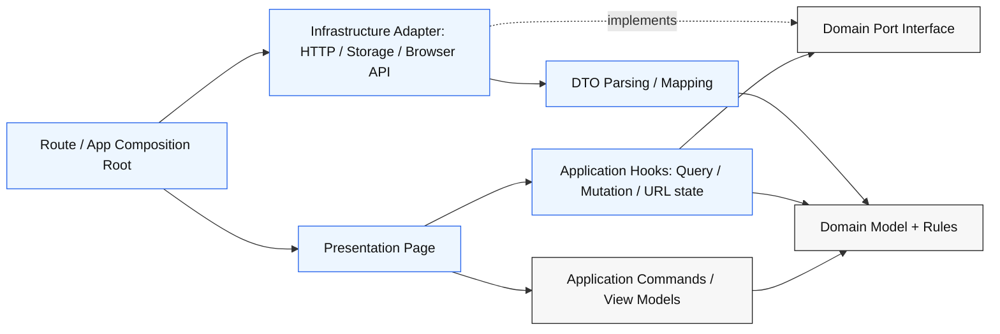

# Hexagonal React

## Overview

Use this skill to keep React applications organized around feature-owned hexagons: pure domain rules and ports in the center, application hooks/use cases around them, infrastructure adapters at the edge, and React UI components as the driving adapter.

React components should remain focused on rendering, events, local UI state, accessibility, and composition. Custom hooks, TanStack Query/SWR calls, business rules, DTO parsing, API contracts, storage, and external services belong outside presentation components.

## Core Schema



Dependency direction:

```txt
presentation  -> application -> domain
infrastructure -> domain
route/composition -> presentation + infrastructure
domain -> nothing feature-external
application -> TanStack Query/custom hooks allowed; no router, no JSX, no MUI, no HTTP client, no browser storage
```

## Canonical Feature Structure

```txt
app/features/<feature>/
  domain/
    <feature>.ts                  # entities, value objects, domain types
    <feature>-repository.ts       # outbound ports as interfaces
    <feature>-rules.ts            # pure calculations and invariants
    <feature>-errors.ts           # domain/application errors if needed

  application/
    <feature>-queries.ts          # custom hooks using TanStack Query/SWR
    <feature>-commands.ts         # framework-free command mappers/use cases
    <feature>-view-model.ts       # pure view model builders, if needed

  infrastructure/
    <feature>-http-repository.ts  # fetch/SDK adapter implementing ports
    <feature>-dto.ts              # unknown -> domain validation and mapping
    <feature>-storage.ts          # localStorage/indexedDB/browser adapters

  presentation/
    <feature>-page.tsx            # React entry point for the feature UI
    <feature>-form.tsx            # UI components
    <feature>-table.tsx
    <feature>-format.ts           # locale/i18n/display formatting

tests/parcours/
  <feature>-onboarding.test.tsx   # only when explicitly requested
  <feature>-budget.test.tsx       # broad user workflow coverage
```

Prefer this structure per feature, not global `domain/`, `services/`, or `components/` buckets. The feature owns its model, ports, adapters, and UI. Parcours tests live above features so they can cover full workflows.

## Layer Responsibilities

| Layer | Owns | Must Not Import |
| --- | --- | --- |
| `domain` | Types, entities, value objects, pure calculations, invariants, outbound ports/interfaces | React, router, query libraries, HTTP clients, browser APIs, infrastructure |
| `application` | Custom hooks, TanStack Query/SWR hooks, use cases, command mapping, cache orchestration | JSX, MUI/UI libraries, router, fetch/axios, localStorage, infrastructure |
| `infrastructure` | HTTP, SDKs, browser storage, DTO validation, adapter errors | Presentation components/hooks |
| `presentation` | React components, forms, loading/error/empty states, formatting | Custom hooks definitions, TanStack Query/SWR calls, raw HTTP calls, DTO parsing, database/SDK details |
| `route` / composition | Wires adapters into presentation entry points | Business logic |
| `tests/parcours` | Explicitly requested journey tests through public route/page/API workflows | Private helpers, isolated components/hooks, hidden cross-feature setup |

## Ports And Adapters

Create a port in `domain` when the feature depends on an external or volatile capability: API, SDK, auth provider, storage, payments, analytics, browser API, feature flag service.

Do not create ports for simple pure helpers. Keep pure logic as functions in `domain` or `application`.

Treat UI and routes as driving adapters: they trigger use cases. Treat HTTP clients, storage, analytics, and browser APIs as driven adapters: the application calls them through ports.

**Domain port:**

```ts
// domain/family-repository.ts
import type { Family, CreateFamilyMemberInput } from "./family";

export interface FamilyRepository {
  getFamily(): Promise<Family>;
  addMember(input: CreateFamilyMemberInput): Promise<Family>;
}
```

**Infrastructure adapter:**

```ts
// infrastructure/family-http-repository.ts
import type { FamilyRepository } from "../domain/family-repository";
import { parseFamilyResponse } from "./family-dto";

export function createFamilyHttpRepository(baseUrl: string): FamilyRepository {
  return {
    async getFamily() {
      const response = await fetch(`${baseUrl}/api/family`);
      return parseFamilyResponse(await response.json());
    },
    async addMember(input) {
      const response = await fetch(`${baseUrl}/api/family/members`, {
        method: "POST",
        headers: { "Content-Type": "application/json" },
        body: JSON.stringify(input),
      });
      return parseFamilyResponse(await response.json());
    },
  };
}
```

**Composition root:**

```tsx
// routes/family.tsx
import { familyHttpRepository } from "~/features/family/infrastructure/family-http-repository";
import { FamilyPage } from "~/features/family/presentation/family-page";

export default function FamilyRoute() {
  return <FamilyPage repository={familyHttpRepository} />;
}
```

## React-Specific Rules

Keep render pure. A component should derive display data from props/state and call mutations from event handlers, not perform business decisions while rendering.

Use effects only to synchronize with external systems. Do not use `useEffect` to derive data that can be calculated during render or in a pure function.

Treat React Query/SWR hooks as application-layer hooks. They may call domain ports, manage cache, expose loading/error states, and update query data. They should not contain DTO validation, raw endpoint strings, MUI/JSX, or substantial business calculations.

Put display formatting in `presentation`, not `domain`: currency, date strings, translated labels, pluralization, table column labels, route labels.

Prefer domain/application view models when TSX starts grouping, reducing, calculating totals, sorting by business priority, or mapping command payloads.

## DTO And Validation Boundary

Never cast unknown API responses directly into domain types.

```ts
// Bad
return (await response.json()) as Family;

// Good
return parseFamilyResponse(await response.json());
```

DTO parsers live in `infrastructure` because they translate an external contract into the internal model. Validate nested arrays and discriminated values before returning domain objects.

## Error And State Boundaries

Application/domain errors should be semantic: `FamilyNotFound`, `InvalidRecurringLine`, `UnauthorizedFamilyAccess`. Infrastructure may wrap transport failures such as HTTP status, timeout, malformed JSON, or SDK errors.

Presentation decides how errors appear: alert, field error, toast, retry button, empty state. Do not let adapters return translated UI copy unless the API contract explicitly owns that copy.

Loading, disabled, empty, optimistic, and retry states are presentation concerns. The domain should never know a query is pending.

## Parcours Test Layout

```txt
tests/parcours/
  family-onboarding.test.tsx
  family-budget.test.tsx
```

Testing rules:

- Do not create tests by default from this skill.
- When the user explicitly asks for tests or parcours coverage, load `write-tests`.
- Test broad user, API, or business workflows through public route/page/API boundaries.
- Prefer one parcours test that covers the meaningful flow over isolated component, hook, DTO, or adapter tests.
- Use existing project test runner, helpers, fixtures, render utilities, and setup.

## Import Audit Commands

Run these checks when auditing a feature:

```bash
rg "@tanstack|react|react-router|@mui|fetch\\(|localStorage|import\\.meta" app/features/<feature>/domain -n
rg "react-router|@mui|fetch\\(|localStorage|import\\.meta" app/features/<feature>/application -n
rg --files app/features/<feature>/application | rg "\\.tsx$"
rg "@tanstack/react-query|useQuery\\(|useMutation\\(" app/features/<feature>/presentation -n
rg "\\.\\./infrastructure|~/features/<feature>/infrastructure" app/features/<feature>/domain app/features/<feature>/application app/features/<feature>/presentation -n
rg "\\.\\./presentation" app/features/<feature>/domain app/features/<feature>/application app/features/<feature>/infrastructure -n
```

Expected:

- No React/framework/browser imports in `domain`.
- No MUI/router/fetch/browser storage/infrastructure imports in `application`; TanStack Query belongs here.
- No custom hook definitions or TanStack Query calls in `presentation`.
- No infrastructure imports from `domain`, `application`, or `presentation`.
- Only routes/composition roots import both `presentation` and `infrastructure`.

## Implementation Checklist

When creating or refactoring a React feature:

1. Identify domain concepts and put them in `domain`.
2. Move calculations, grouping, totals, invariants, and command mapping out of TSX.
3. Define domain ports for external dependencies.
4. Implement adapters in `infrastructure`.
5. Keep custom hooks and React Query/SWR hooks in `application`, calling domain ports.
6. Wire real adapters in route/app composition.
7. Add tests only when explicitly requested; then use `write-tests` and place parcours tests in `tests/parcours/`.
8. Run relevant existing checks: targeted tests if changed, typecheck, and build.

## Common Mistakes

- Putting `fetch`, SDK calls, or endpoint strings in components.
- Putting React Query hooks in `presentation`.
- Putting ports in `application` instead of `domain`.
- Calling formatters with locale/currency from `domain`.
- Validating only the top-level API object and casting nested arrays.
- Creating a port for every helper instead of only external/volatile dependencies.
- Writing isolated component, hook, DTO, or adapter tests by default instead of explicit parcours tests.
- Dispersing tests under each layer when the intended coverage is a full user workflow.
- Letting `domain` import shared UI types or design-system helpers.
- Returning transport errors directly to components instead of mapping them to feature-level error semantics.

## Research Basis

- Alistair Cockburn's original Ports and Adapters / Hexagonal Architecture article: https://alistair.cockburn.us/hexagonal-architecture
- React docs on pure components: https://react.dev/learn/keeping-components-pure
- React docs on avoiding unnecessary Effects: https://react.dev/learn/you-might-not-need-an-effect
