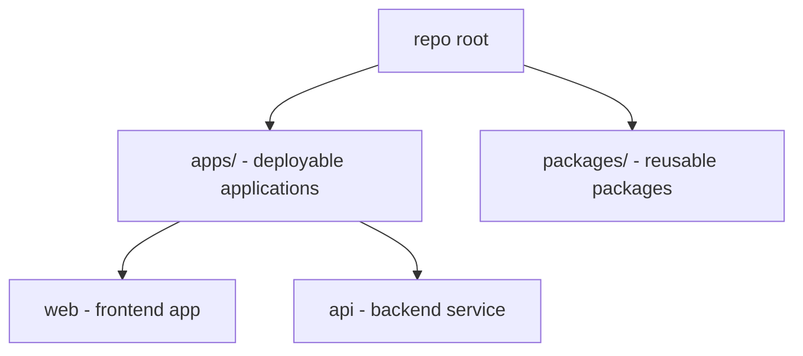

# Write Agent Instructions

## Purpose

Use this skill to create or update `AGENTS.md` files that help coding agents work correctly inside a repository.

The output is not a generic architecture essay. It is repo-specific operating guidance: where code lives, how responsibilities are separated, which patterns are already established, which architecture should be standardized, and which checks an agent should run after changes.

Do not refactor the repository while using this skill unless the user explicitly asks for code changes. The default deliverable is one or more `AGENTS.md` files.

## Inputs

Optional invocation arguments:

$ARGUMENTS

The user may provide no arguments, a path inside the active repository, a stack, architecture preferences, or additional architecture facts. Treat arguments as constraints and context, not as proof. Verify them against the repository and Exa research before they become instructions.

Assume the agent is invoked from inside the intended repository. Do not search for sibling or child repositories as separate targets.

When there are no arguments, run in `auto strict` mode:

1. Resolve the active Git root as the target repository.
2. If the target repository is a monorepo, work from the monorepo root and account for every service, app, package, and shared boundary in that monorepo.
3. Otherwise, work on the classic repository as a single target.

When arguments are provided, treat them as targets or constraints:

- paths inside the active repository identify areas of interest, but a monorepo remains a whole-repository scope unless the user explicitly asks for an additional scoped instruction file;
- stack names help prioritize relevant files and commands;
- architecture preferences guide standardization, but must not override clear repo facts without saying so;
- extra user facts can explain intent or legacy constraints, but still need repository and research validation.

## Required Workflow

### 1. Discover Scope

Inspect before asking questions.

Use `rg`, `find`, `git`, and package manifests to identify:

- the current Git root, which is the target repository;
- whether the target repository is a monorepo or a classic repository;
- workspace or monorepo markers such as `pnpm-workspace.yaml`, `turbo.json`, `nx.json`, root `package.json` workspaces, `lerna.json`, `rush.json`, `Cargo.toml` workspaces, `go.work`, or multi-app `apps/` plus `packages/`;
- existing instruction files such as `AGENTS.md`, `AGENTS.override.md`, `CLAUDE.md`, `GEMINI.md`, `.cursorrules`, or repo docs;
- README files, package scripts, CI workflows, lint/type/test/build commands;
- app, package, service, library, domain, infrastructure, UI, API, database, and test directories.

Only ask the user if the monorepo/classic-repo classification remains ambiguous after inspection.

### 2. Identify Actual Architecture

Read enough code to infer the architecture that is really present.

Look for:

- frontend framework, backend framework, language, package manager, runtime, build system, and deployment shape;
- module boundaries, feature directories, shared packages, services, repositories, controllers/routes, hooks, API clients, schemas, DTOs, components, and tests;
- existing validation, typing, error handling, auth, data fetching, state management, persistence, and design-system patterns;
- import direction and boundary violations;
- duplicate business logic or unclear shared folders.

Do not blindly preserve existing repo patterns. The goal is to rationalize the architecture, not just describe whatever exists.

Use this balance:

- about 66% alignment with the architecture pattern as it is normally understood from research, such as clean architecture, hexagonal architecture, layered architecture, vertical slice architecture, or a framework-native architecture;
- about 33% freedom for existing project conventions, pragmatic constraints, legacy structure, and local naming that already works.

This ratio is a judgment aid, not a math exercise. It means the generated instructions should make a messy repository more coherent without pretending it can or should become a textbook implementation overnight.

### 3. Research With Exa MCP

Always use Exa MCP before choosing or documenting the target architecture, even when repository inspection already seems sufficient.

Run at least two Exa searches:

- one search for the detected or requested architecture pattern, such as hexagonal architecture, clean architecture, ports and adapters, layered architecture, vertical slice architecture, monorepo architecture, or frontend feature architecture;
- one search for the actual stack or framework architecture conventions, such as Next.js, React, NestJS, Hono, Django, Rails, Spring, Go services, Turborepo, pnpm workspaces, or the detected build/runtime ecosystem.

If the repository is inconsistent, weirdly organized, or poorly follows its claimed architecture, run one additional Exa search for migration or rationalization guidance for that architecture and stack.

Prioritize primary or high-quality sources:

- official framework documentation;
- well-known architecture sources such as Ports and Adapters, Clean Architecture, ADR guidance, monorepo/workspace documentation, and framework maintainers;
- official package manager, build tool, or cloud platform docs.

Do not paste long research summaries into `AGENTS.md`. Convert research into short, enforceable repo rules.

### 4. Choose The Standard Architecture

Name the architecture in plain language. Examples:

- feature-oriented React app with application hooks and infrastructure adapters;
- Node API with thin HTTP adapters, application services, domain rules, and persistence adapters;
- Next.js app-router application with server actions/API routes at boundaries and feature-owned UI;
- monorepo with deployable apps in `apps/` and reusable packages in `packages/`;
- layered service architecture where controllers call services and repositories own persistence.

Do not force hexagonal architecture everywhere. Use the Exa research and repository facts to choose the closest defensible target. Use ports and adapters only where external dependencies, business rules, and testability justify it.

When the repository claims one architecture but implements another, say so in the analysis and standardize toward the closest rational target. Examples:

- a "clean architecture" repo with controllers calling persistence directly should be documented as a layered service architecture unless the existing code can realistically support use cases and adapters;
- a "hexagonal" repo with no meaningful domain rules or ports should be documented as framework-native modules with infrastructure boundaries;
- a frontend app with many shared folders but feature-owned workflows should be documented as feature-oriented, not as a generic component library architecture.

Standardize toward:

- one owner for each business rule;
- clear dependency direction;
- explicit validation at boundaries;
- reusable UI, schema, and type primitives;
- feature or package boundaries that match the repo;
- stable commands for lint, type checks, tests, and builds.

### 5. Write Or Update AGENTS.md

When an `AGENTS.md` already exists, preserve useful project-specific guidance and remove stale or duplicated architecture guidance. Do not duplicate global coding rules unless they are repo-specific or critical.

Every generated `AGENTS.md` must:

- be under 300 lines;
- include a Mermaid TreeView diagram;
- explain the architecture in detail;
- state the scope of the file, covering the full monorepo when the repository is a monorepo;
- document dependency boundaries and ownership;
- list relevant commands discovered from the repo;
- describe validation, typing, testing, and UI/backend conventions when applicable;
- avoid secrets, private values, generated output, or speculative instructions.

Use this Mermaid TreeView format:

````md

````

If Mermaid cannot represent the exact tree cleanly, keep the diagram concise and cover the remaining details in text.

## AGENTS.md Template

Use this structure unless the repo already has a stronger local convention:

````md
# AGENTS.md

## Scope

These instructions apply to ...

## Architecture


Explain the architecture in concrete terms:

- what is deployable;
- where business logic belongs;
- where framework adapters live;
- where shared types, schemas, UI, and utilities live;
- which dependency directions are allowed.

## Working Rules

- Reuse existing components, services, hooks, schemas, types, and utilities before creating new ones.
- Keep business rules in the owning domain/service/module.
- Validate untrusted input at boundaries.
- Keep UI components focused on rendering and interaction.
- Keep controllers/routes thin when backend code exists.
- Do not add tests, logs, dependencies, or broad refactors unless requested.

## Commands

- Install: `...`
- Lint: `...`
- Type check: `...`
- Test: `...`
- Build: `...`

## Notes

Add only repo-specific caveats, generated-code warnings, or ownership rules.

```

```
````

Remove unavailable commands from the template. If a command cannot be confirmed, say so briefly rather than inventing it.

## Architecture Guidance

### Monorepos

For monorepos, work from the monorepo root and document every service, app, package role, and shared boundary instead of every folder. Do not split the task into child repositories.

Recommended conventions:

- `apps/` contains deployable products or services;
- `packages/` contains reusable libraries, contracts, UI, config, or tooling;
- apps must not import deep internals from other apps;
- shared packages should expose stable public entry points;
- dependencies should be installed where they are used;
- generated code and build output should stay out of hand-written architecture rules.

If the monorepo uses a different convention, describe the existing convention and rationalize it rather than renaming it in documentation.

### Backend Services

For backend repos, document the real boundary shape.

Prefer:

- routes/controllers own transport parsing and response mapping;
- services or use cases own workflows and business rules;
- repositories/adapters own persistence and external SDK calls;
- schemas/DTOs validate untrusted input at boundaries;
- auth and authorization are enforced server-side;
- transactions wrap multi-step writes that must stay consistent.

If ports and adapters fit the repo, place port interfaces with the code that owns the business need and adapters at the framework or infrastructure edge.

### Frontend Apps

For frontend repos, document component and data boundaries.

Prefer:

- pages/routes compose features and providers;
- presentation components render UI and manage local interaction state;
- hooks own async state, cache orchestration, and feature workflows;
- API clients or repositories own raw network calls;
- schemas/DTO mappers validate external data before it becomes app state;
- design-system primitives are reused before local styling.

Do not tell agents to create new UI primitives when the repo already has usable primitives.

### Full-Stack Apps

For full-stack repos, document where the client/server boundary is enforced.

Include:

- server-only modules and client-only modules;
- shared contracts, schemas, and types;
- where authentication and authorization are checked;
- where database and external provider calls are allowed;
- how data moves from request to validation to business logic to response/UI.

## Quality Bar

Before finishing:

- review the diff and confirm the chosen `AGENTS.md` scope is correct;
- confirm the Mermaid diagram renders as valid Mermaid syntax;
- confirm the file is under 300 lines;
- confirm commands are real or clearly marked as unavailable;
- confirm old or contradictory architecture instructions were removed;
- run relevant lightweight checks if the repo has them and they do not rewrite files;
- summarize which files were written and which assumptions were made.

Do not create test files or eval workspaces by default for this skill. If the user explicitly asks to evaluate the skill, then follow the normal skill evaluation workflow.
